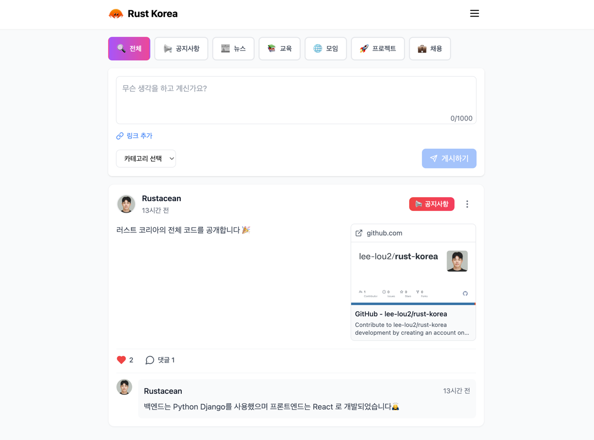

# Rust Korea 🦀

[](https://rust-lang.kr)
[](LICENSE)

**Rust Korea**는 국내 Rust 개발자와 사용자를 위한 공식 커뮤니티 플랫폼입니다.  
여기서 Rust 관련 **뉴스**, **강의 정보**, **기술 공유**, **온·오프라인 모임**, **프로젝트 추천**, **이벤트 소식** 등 다양한 활동을 즐겨보세요!  
Rust에 관심 있는 누구나 Rust Korea 커뮤니티에 참여하여 지식과 경험을 함께 나누며 성장할 수 있습니다.

## 🌐 소개

- **Rust Korea 공식 홈페이지:** [https://rust-lang.kr](https://rust-lang.kr)  
- **GitHub 저장소:** [lee-lou2/rust-korea](https://github.com/lee-lou2/rust-korea)

본 프로젝트는 **Python Django**로 구현된 백엔드 애플리케이션을 기반으로 제공됩니다. 앞으로도 더욱 풍성한 기능과 서비스를 통해 국내 Rust 커뮤니티를 활성화할 예정입니다.



## ✨ 주요 기능

- **📰 뉴스/강의 정보 공유:** Rust 최신 소식 및 유용한 강의를 손쉽게 확인하고 공유할 수 있습니다.
- **💬 기술 토론 및 질의응답:** Rust 개발 관련 문제나 궁금증을 자유롭게 토론하고 해결할 수 있습니다.
- **🎉 온·오프라인 모임 정보:** Rust 스터디 그룹, 밋업 등 다양한 이벤트를 소개하고 참여할 수 있습니다.
- **🔧 프로젝트 추천:** 흥미로운 Rust 오픈소스 프로젝트나 활용 사례를 발굴하고 함께 성장해나갈 수 있습니다.

## 💻 프로젝트 실행 방법

아래 명령어들은 로컬 환경에서 Django 백엔드를 실행하기 위한 기본 예시입니다.

### 🧰 사전 준비사항

- Python (3.10 이상 권장)
- pipenv 또는 virtualenv (선택 사항)
- Git

### ⚙️ 설치 및 실행

0. **환경 변수 설정**

    ```shell
    # src/.env
    SECRET_KEY=
    DEBUG=
    
    GOOGLE_CLIENT_ID=
    GOOGLE_CLIENT_SECRET=
    ```

1. **저장소 클론하기**
    ```bash
    git clone https://github.com/lee-lou2/rust-korea.git
    cd rust-korea
    ```

2. **가상환경 준비 (선택 사항)**
    ```bash
    # virtualenv 사용 시
    python3 -m venv venv
    source venv/bin/activate
    ```

3. **필요한 패키지 설치**
    ```bash
    pip install -r requirements.txt
    ```

4. **마이그레이션 및 초기화**
    ```bash
    python manage.py migrate
    ```

5. **개발 서버 실행**
    ```bash
    python manage.py runserver
    ```

브라우저에서 [http://127.0.0.1:8000](http://127.0.0.1:8000) 에 접속하면 백엔드 서비스에 접근할 수 있습니다.

### 🤝 기여 방법

Rust Korea 커뮤니티는 오픈소스 정신을 바탕으로 성장해나갑니다.  
이슈, 기능 제안, 버그 리포트, 코드 기여 등 언제든지 환영합니다!  

Rust Korea 커뮤니티와 함께 Rust 언어의 매력을 탐구하고, 더 깊은 실력을 키워보세요!  
문의나 건의사항은 언제든지 **이슈 트래커**에 남겨주세요.